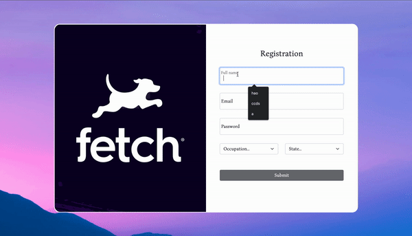

# Fetch Rewards Frontend Home Exercise

## Preview: 

<p align="center">
  
</p>


## Getting Started
### 1. Clone the repository or download the zip
```
git clone 
```

### 2. Install the dependencies
```
npm install
```

### 3. Start the application (Recommend using Google Chrome)
```
npm start
```
## Thank you

I hope you enjoy the project.

-- [Hao On](https://www.linkedin.com/in/hao-on/)
